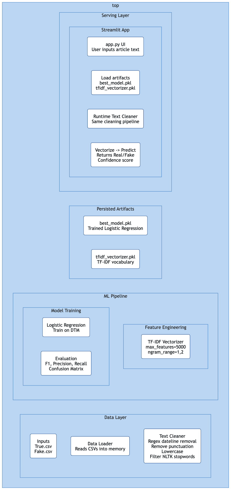
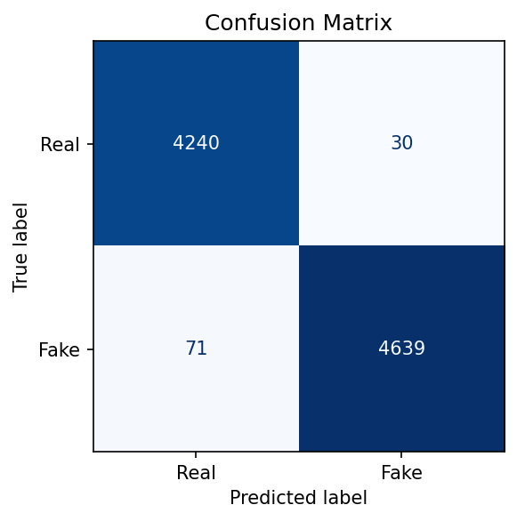
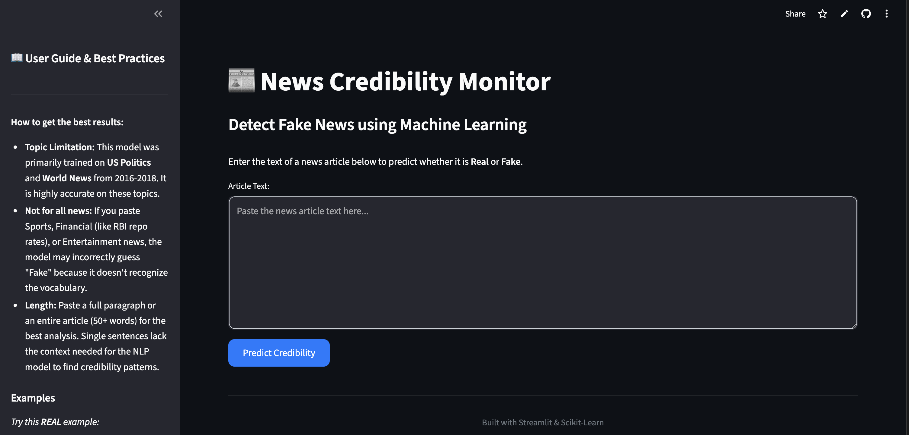

<div align="center">

# 📰 Project 11: Intelligent News Credibility Analysis & Agentic Misinformation Monitoring

### From Predictive NLP to Autonomous Fact-Checking.

[](https://news-credibility-monitor.streamlit.app/)


[Live Demo](https://news-credibility-monitor.streamlit.app/) · [Project Video](https://drive.google.com/file/d/1C95FawY-ujWq7PCB5p-TzQittajUy3Yl/view) · [Report (PDF)](Report/report.pdf)

</div>

---

## Highlights

| Metric | Value |
|--------|-------|
| **Accuracy** | 98.88% |
| **Weighted F1-Score** | 98.88% |
| **Dataset** | ISOT Fake News (44,898 articles) |
| **Model** | Logistic Regression (TF-IDF + Bigrams) |
| **Deployment** | Streamlit Community Cloud |
| **Milestone** | 1 of 2 — Classical ML (No LLMs) |

---

## Milestone 1 vs Milestone 2

| Aspect | Milestone 1 (Current) | Milestone 2 (Future) |
|--------|----------------------|---------------------|
| **Approach** | Classical NLP & Traditional ML | Agentic AI & LLM-based Reasoning |
| **Feature Extraction** | TF-IDF Vectorization (10,000 features, bigrams) | LLM Embeddings & Semantic Analysis |
| **Model** | Logistic Regression (`scikit-learn`) | LangGraph-based Multi-Agent System |
| **Fact-Checking** | Statistical pattern recognition | Autonomous web search & cross-referencing |
| **Explainability** | Confidence score (sigmoid probability) | LIME/SHAP + LLM-generated explanations |
| **Data** | ISOT Fake News Dataset (static, 2016–2018) | Real-time news ingestion & verification |
| **Scope** | Binary classification (Real vs Fake) | Multi-dimensional credibility scoring |
| **Tech Stack** | Scikit-Learn, NLTK, Streamlit | LangGraph, LangChain, Google Gemini |

> [!IMPORTANT]
> **Milestone 1 uses only traditional Machine Learning.** No Large Language Models (LLMs), transformer architectures, or Agentic AI frameworks are used in the current implementation. This is by design to establish a strong classical baseline.

---

## Technology Stack

| Layer | Technology | Purpose |
|-------|-----------|---------|
| **Language** | Python 3.10+ | Core programming language |
| **ML Framework** | Scikit-Learn 1.8 | Model training, TF-IDF vectorization, evaluation |
| **NLP** | NLTK | Stopword removal, text preprocessing |
| **Data** | Pandas, NumPy | Data manipulation and numerical operations |
| **Visualization** | Matplotlib, Seaborn | EDA plots, confusion matrix |
| **Web App** | Streamlit 1.54 | Interactive UI for real-time predictions |
| **Serialization** | Joblib | Model & vectorizer persistence |
| **Version Control** | Git + Git LFS | Source code & large file management |

> [!NOTE]
> The approved tech stack for Milestone 1 is limited to **Scikit-Learn** for ML and **Streamlit** for deployment. All components strictly adhere to this requirement.

---

## Functional Requirements

| # | Requirement | Status |
|---|-------------|--------|
| FR-1 | Accept raw news article text as input | ✅ Implemented |
| FR-2 | Preprocess text (cleaning, stopword removal, TF-IDF) | ✅ Implemented |
| FR-3 | Classify article as Real or Fake | ✅ Implemented |
| FR-4 | Display confidence score with prediction | ✅ Implemented |
| FR-5 | Validate input length and warn on short text | ✅ Implemented |
| FR-6 | Provide user guide with model limitations | ✅ Implemented |
| FR-7 | Deploy as a web application | ✅ Streamlit Cloud |
| FR-8 | Modular, production-ready codebase | ✅ Implemented |

---

## Evaluation Criteria

| Criteria | Weight | Evidence |
|----------|--------|----------|
| **Code Quality & Modularity** | 20% | Cookiecutter-style `src/` layout with separated concerns |
| **ML Pipeline** | 25% | End-to-end: ingestion → cleaning → TF-IDF → training → evaluation |
| **Model Performance** | 20% | 98.88% accuracy, 98.88% weighted F1, per-class metrics |
| **Deployment** | 15% | Live Streamlit app with cached inference, input validation |
| **Documentation** | 10% | README, LaTeX report, notebooks, system design diagram |
| **Video Presentation** | 10% | 5-minute project walkthrough |

---

## System Architecture

```
┌─────────────────────────────────────────────────────────────┐
│                    DATA INGESTION                           │
│   Fake.csv + True.csv → load_data.py → Merged DataFrame    │
└──────────────────────────┬──────────────────────────────────┘
                           │
                           ▼
┌─────────────────────────────────────────────────────────────┐
│                  TEXT PREPROCESSING                          │
│   text_cleaner.py: Dateline removal → Lowercasing →         │
│   Regex cleaning → Stopword removal                         │
└──────────────────────────┬──────────────────────────────────┘
                           │
                           ▼
┌─────────────────────────────────────────────────────────────┐
│                FEATURE ENGINEERING                           │
│   TF-IDF Vectorizer: max_features=10000, ngram_range=(1,2) │
└──────────────────────────┬──────────────────────────────────┘
                           │
                           ▼
┌─────────────────────────────────────────────────────────────┐
│                  MODEL TRAINING                              │
│   Logistic Regression: solver=lbfgs, class_weight=balanced  │
└──────────────────────────┬──────────────────────────────────┘
                           │
                           ▼
┌─────────────────────────────────────────────────────────────┐
│              EVALUATION & DEPLOYMENT                         │
│   evaluate.py → metrics.json + confusion_matrix.png         │
│   app.py → Streamlit Cloud (requirements_deploy.txt)        │
└─────────────────────────────────────────────────────────────┘
```

<div align="center">
  
</div>

---

## Dataset

The [ISOT Fake News Dataset](https://onlineacademiccommunity.uvic.ca/isot/2022/11/27/fake-news-detection-datasets/) is used for training and evaluation:

| Split | Real Articles | Fake Articles | Total |
|-------|--------------|---------------|-------|
| Full Dataset | 21,417 | 23,481 | 44,898 |
| Train (80%) | ~17,134 | ~18,785 | ~35,918 |
| Test (20%) | 4,270 | 4,710 | 8,980 |

- **Source:** Reuters (Real) and unreliable sources flagged by Politifact & Wikipedia (Fake)
- **Time Period:** 2016–2018, primarily US Politics and World News
- **Features Used:** Concatenated `title + text` for richer semantic signal
- **Citation:** Ahmed, H., Traore, I., & Saad, S. (2017). *Detection of Online Fake News Using N-Gram Analysis and Machine Learning Techniques.* ISDDC 2017.

---

## Methodology

### Text Preprocessing (`src/utils/text_cleaner.py`)
1. **Dateline Stripping** — Removes publisher prefixes like `"WASHINGTON (Reuters) -"` to prevent source leakage
2. **Lowercasing** — Normalizes all text to lowercase
3. **Special Character Removal** — Strips non-alphabetic characters via regex
4. **Stopword Removal** — Filters English stopwords using NLTK

### Feature Engineering (`src/features/build_features.py`)
- **TF-IDF Vectorization** with `max_features=10,000` and `ngram_range=(1, 2)`
- Unigrams + bigrams capture both individual terms and phrase-level patterns (e.g., "breaking news", "sources say")

### Model Selection (`src/models/train.py`)
- **Logistic Regression** chosen for:
  - High interpretability (feature coefficients reveal which words signal fake/real)
  - Strong baseline performance on text classification tasks
  - Fast training and inference suitable for real-time deployment
  - Probabilistic output for confidence scoring
- `class_weight="balanced"` compensates for the slight class imbalance (52.3% Fake vs 47.7% Real)
- `solver="lbfgs"` provides efficient optimization for L2-regularized logistic regression

---

## Performance Metrics

| Metric | Score |
|--------|-------|
| **Accuracy** | 98.88% |
| **Precision** (weighted) | 98.88% |
| **Recall** (weighted) | 98.88% |
| **F1-Score** (weighted) | 98.88% |

### Per-Class Performance

| Class | Precision | Recall | F1-Score | Support |
|-------|-----------|--------|----------|---------|
| Real | 98.35% | 99.30% | 98.82% | 4,270 |
| Fake | 99.36% | 98.49% | 98.92% | 4,710 |

### Confusion Matrix

<div align="center">
  
</div>

| | Predicted Real | Predicted Fake |
|---|---|---|
| **Actual Real** | 4,240 (TN) | 30 (FP) |
| **Actual Fake** | 71 (FN) | 4,639 (TP) |

---

## Repository Structure

```
News-Credibility-Monitor/
│
├── app.py                          # Streamlit web application
├── requirements.txt                # Full development dependencies
├── requirements_deploy.txt         # Lean deployment dependencies
├── README.md
├── .gitattributes                  # Git LFS tracking rules
│
├── data/
│   ├── raw/                        # Original ISOT dataset (Git LFS)
│   │   ├── Fake.csv
│   │   └── True.csv
│   ├── interim/                    # Merged data (gitignored, reproducible)
│   └── processed/                  # Cleaned data (gitignored, reproducible)
│
├── models/                         # Trained artifacts (Git LFS)
│   ├── best_model.pkl              # Serialized Logistic Regression model
│   ├── tfidf_vectorizer.pkl        # Fitted TF-IDF vectorizer
│   ├── metrics.json                # Evaluation metrics
│   └── confusion_matrix.png        # Confusion matrix visualization
│
├── notebooks/                      # Jupyter notebooks for exploration
│   ├── 01_data_exploration.ipynb   # EDA, class distribution, article lengths
│   ├── 02_feature_engineering.ipynb # Text cleaning & TF-IDF vectorization
│   └── 03_model_comparison.ipynb   # LR vs DT vs RF comparison
│
├── src/                            # Source code (modular pipeline)
│   ├── config/
│   │   └── config.py               # Centralized path configuration
│   ├── data/
│   │   └── load_data.py            # Data loading, labeling, merging
│   ├── features/
│   │   └── build_features.py       # TF-IDF feature engineering
│   ├── models/
│   │   ├── train.py                # Model training
│   │   └── evaluate.py             # Evaluation, metrics export, plots
│   ├── pipeline/
│   │   └── training_pipeline.py    # End-to-end orchestration
│   └── utils/
│       └── text_cleaner.py         # NLP text preprocessing
│
├── Report/                         # LaTeX report & compiled PDF
│   └── report.tex
│
└── docs/                           # Documentation assets
    ├── system_design.png           # Architecture diagram
    └── ui.png                      # Application screenshot
```

---

## Installation & Usage

### Prerequisites
- Python 3.10+
- Git LFS (for large data/model files)

> [!WARNING]
> **Localhost:** You must install Git LFS and run `git lfs pull` after cloning to download the dataset and model files. Without this step, the CSV and PKL files will be LFS pointers and the application will not function.

### Setup

```bash
# Clone the repository
git clone https://github.com/aryankinha/News-Credibility-Monitor.git
cd News-Credibility-Monitor

# Install Git LFS and pull large files
git lfs install
git lfs pull

# Create virtual environment
python -m venv venv
source venv/bin/activate  # macOS/Linux

# Install dependencies
pip install -r requirements.txt
```

### Train the Model

```bash
python -m src.pipeline.training_pipeline
```

This will:
1. Load and merge the ISOT dataset from `data/raw/`
2. Clean and preprocess all text
3. Build TF-IDF features (10,000 dimensions)
4. Train a Logistic Regression model
5. Evaluate and save metrics to `models/metrics.json`
6. Save the trained model and vectorizer to `models/`

### Run the Streamlit App Locally

```bash
streamlit run app.py
```

> [!WARNING]
> **Localhost:** The app runs on `http://localhost:8501` by default. Ensure ports are not blocked by firewall. The first run may take a few seconds for model loading (cached via `@st.cache_resource`).

---

## Deployment

The app is deployed on **Streamlit Community Cloud** using `requirements_deploy.txt` for minimal dependencies.

| Configuration | Value |
|--------------|-------|
| **Platform** | Streamlit Community Cloud |
| **Main file** | `app.py` |
| **Python version** | 3.10 |
| **Requirements** | `requirements_deploy.txt` |
| **Model size** | ~80 KB (model) + ~386 KB (vectorizer) |

### Deploy Your Own Instance
1. Fork this repository
2. Go to [share.streamlit.io](https://share.streamlit.io)
3. Connect your GitHub repo and set the main file to `app.py`
4. Set the requirements file to `requirements_deploy.txt`

---

## Application Screenshots

<div align="center">
  
</div>

---

## Project Video

🎥 **[Watch the 5-minute project walkthrough](https://youtu.be/YOUR_VIDEO_LINK)**

*(Replace with your actual video link after recording)*

---

## Future Work (Milestone 2)

- **Agentic AI:** LangGraph-based multi-agent system for autonomous fact-checking
- **LLM Integration:** Google Gemini for semantic analysis and credibility reasoning
- **Real-time Verification:** Automated web search to cross-reference claims
- **Explainability:** LIME/SHAP-based per-prediction explanations in the UI
- **Cross-domain:** Generalization beyond US political news

---

## References

1. Ahmed, H., Traore, I., & Saad, S. (2017). *Detection of Online Fake News Using N-Gram Analysis and Machine Learning Techniques.* ISDDC 2017, LNCS, vol. 10618, pp. 127–138.
2. Ahmed, H., Traore, I., & Saad, S. (2018). *Detecting opinion spams and fake news using text classification.* Security and Privacy, 1(1), e9.
3. Pedregosa, F. et al. (2011). *Scikit-learn: Machine Learning in Python.* JMLR, 12, 2825–2830.
4. Joachims, T. (1998). *Text categorization with support vector machines.* ECML, pp. 137–142.

---

## License

This project is developed as part of an academic capstone at **Rishihood University, Newton School of Technology**. All rights reserved.

---

<div align="center">
  <b>Built with</b> ❤️ <b>using Python, Scikit-Learn & Streamlit</b>
  <br><br>
  <i>Project 11 — GenAI Capstone 2026 | Milestone 1: Classical ML</i>
</div>
